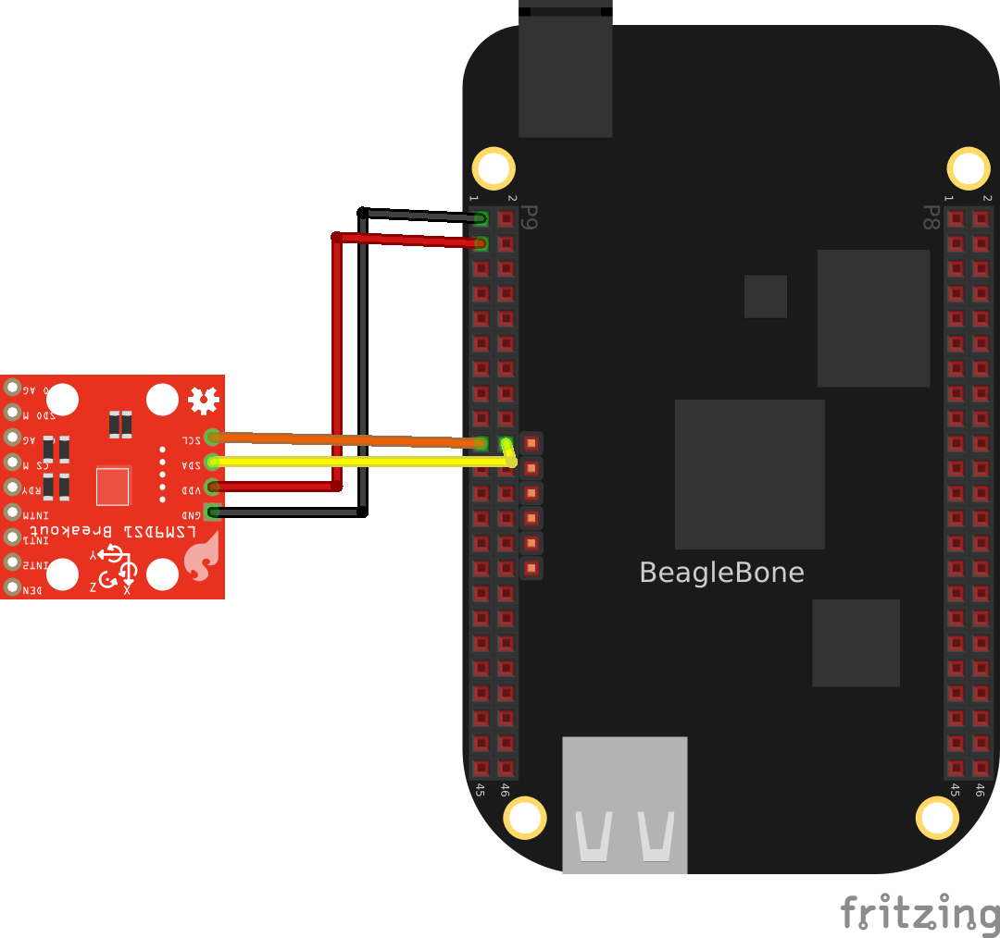

# lsm9ds1
Linux kernel iio module for lsm9ds1 IMU device.

It is composed of 2 devices on a same chip:

* an accelerometer and gyroscope;
* a magnetometer

They can be connected as *I2C* or *SPI* devices. In *SPI*, one or two
*GPO* should be use to select to which subdevice is listening.

The accelerometer and gyroscope have:

* the same measurment frequency when they are activated together
  (which is the only implemented case for the moment);
* a common hardware buffer, with an I/O for configurable trigger.
* a (poor?) temperature sensor


# Status #

* [x] *i2c* support;
* [ ] *spi* support;
* [x] basic iio device support:
  * [x] accelerometer support;
  * [x] gyroscope support;
  * [x] magnetometer support;
  * [x] temperature support;
* [x] iio software buffer support:
  * [x] accelerometer and gyroscope support;
  * [x] magnetometer support;
* [x] hardware buffer support:
  * [x] accelerometer and gyroscope support;
* [ ] trigger support:
  * [ ] accelerometer and gyroscope support;
  * [ ] magnetometer support;
* [ ] frequency setting:
  * [ ] accelerometer and gyroscope support;
  * [ ] magnetometer support;
* [ ] scale setting:
  * [ ] accelerometer and gyroscope support;
  * [ ] magnetometer support;
* [ ] other setting:
  * [ ] accelerometer and gyroscope support;
  * [ ] magnetometer support;


# How to make it work #

## Basic *I2C* wiring ##



### Device declaration in `sysfs` ###

At each boot:

```shell
echo lsm9ds1_ag 0x6b > /sys/bus/i2c/devices/i2c-2/new_device
echo lsm9ds1_m 0x1e > /sys/bus/i2c/devices/i2c-2/new_device
```

### Device declaration in device tree ###

Before compiling your `dtb`:

```
&i2c2 {
	lsm9ds1ag0@6b {
		compatible = "st,lsm9ds1_ag";
		reg = <0x6b>;
	};

	lsm9ds1m0@1e {
		compatible = "st,lsm9ds1_m";
		reg = <0x1e>;
	};
};
```

### Basic reading ###

```shell
iio_info
```

or 

```shell
cat /sys/bus/iio/devices/iio\:device0/in_accel0_x_raw
```


### Buffered reading with iio software timer trigger ###

Setting the iio software timer trigger at $2Hz$ for the `iio:device0`:

```shell
modprobe iio-trig-hrtimer
mkdir /config
mount -t configfs none /config/
mkdir /config/iio/triggers/hrtimer/instance1
echo 2 > /sys/bus/iio/devices/trigger0/sampling_frequency
cat /sys/bus/iio/devices/trigger0/name > /sys/bus/iio/devices/iio\:device0/trigger/current_trigger
```

Enable and reading the buffer:

```shell
for /sys/bus/iio/devices/iio\:device0/scan_elements/*_en; do echo 1 > $i; done
echo 1 > /sys/bus/iio/devices/iio\:device0/buffer/enable
cat /dev/iio\:device0
```
